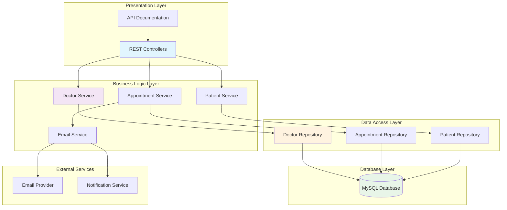
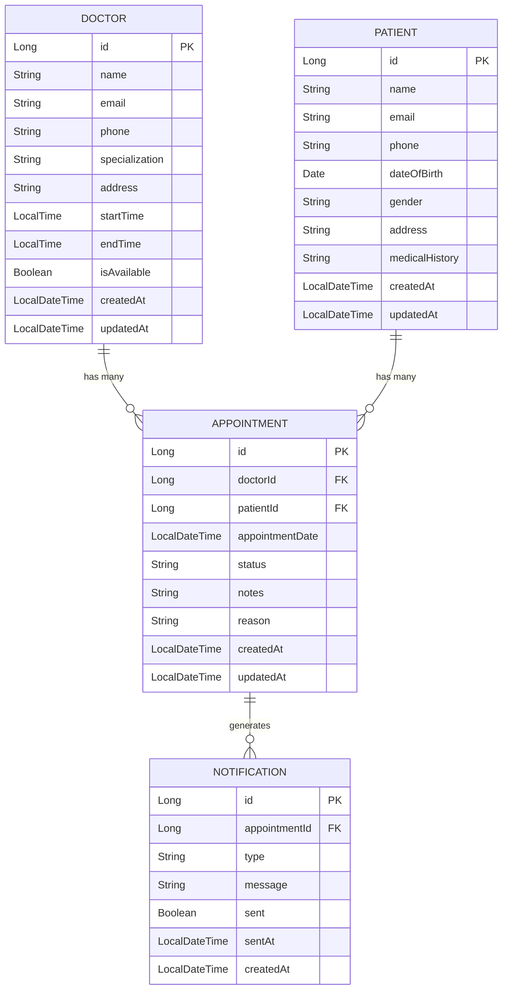
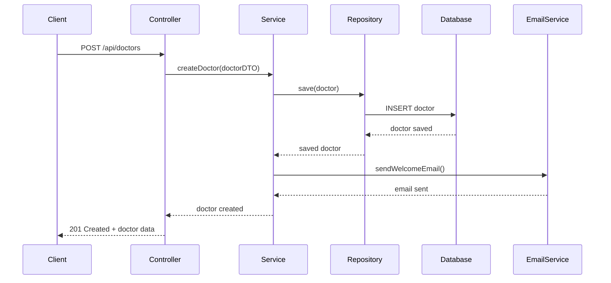
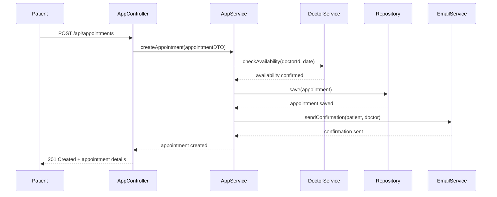
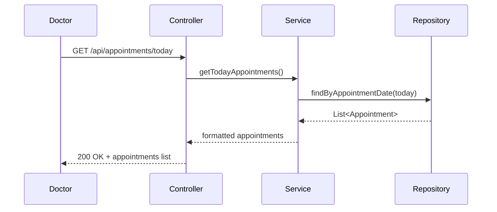

# 🏥 Smart Healthcare Appointment System

A comprehensive healthcare management system built with **Spring Boot** that streamlines appointment scheduling, doctor management, patient records, and real-time notifications for modern healthcare facilities.


## 🌟 Features

### 📅 **Appointment Management**
- **Schedule Appointments**: Create and manage patient appointments with doctors
- **Real-time Availability**: Check doctor availability and schedule accordingly
- **Automated Notifications**: Email notifications for appointment confirmations and reminders
- **Today's Appointments**: Quick view of current day's scheduled appointments

### 👨‍⚕️ **Doctor Management**
- **Doctor Profiles**: Comprehensive doctor information with specializations
- **Availability Management**: Set and update doctor working hours and availability
- **Specialization Tracking**: Organize doctors by medical specialties
- **Documentation**: Complete API documentation for doctor operations

### 👥 **Patient Management**
- **Patient Records**: Secure storage and management of patient information
- **Medical History**: Track patient medical history and previous appointments
- **Contact Management**: Patient contact information and communication preferences

### 📧 **Communication System**
- **Email Service**: Automated email notifications for appointments
- **Real-time Updates**: Instant notifications for appointment changes
- **Reminder System**: Automated appointment reminders

## 🏗️ System Architecture



## 🗄️ Database Design



## 🔄 System Workflows

### 📋 Add Doctor Workflow



### 📅 Book Appointment Workflow



### 📊 Daily Appointments View



## 🚀 Getting Started

### Prerequisites
- **Java 17+**
- **Maven 3.6+**
- **MySQL 8.0+**
- **Git**

### Installation

1. **Clone the repository**
   ```bash
   git clone https://github.com/Tojan-Naiem/Smart-Healthcare-Appointment-System.git
   cd Smart-Healthcare-Appointment-System
   ```

2. **Switch to develop branch**
   ```bash
   git checkout develop
   ```

3. **Configure Database**
   ```properties
   # application.properties
   spring.datasource.url=jdbc:mysql://localhost:3306/healthcare_db
   spring.datasource.username=your_username
   spring.datasource.password=your_password
   ```

4. **Configure Email Service**
   ```properties
   # Email configuration
   spring.mail.host=smtp.gmail.com
   spring.mail.port=587
   spring.mail.username=your_email@gmail.com
   spring.mail.password=your_app_password
   ```

5. **Build and Run**
   ```bash
   ./mvnw clean install
   ./mvnw spring-boot:run
   ```

6. **Access the Application**
   - **API Base URL**: `http://localhost:8080/api`
   - **Documentation**: `http://localhost:8080/swagger-ui.html`

## 📡 API Endpoints

### 👨‍⚕️ Doctor Management
```http
GET    /api/doctors              # Get all doctors
POST   /api/doctors              # Create new doctor
GET    /api/doctors/{id}         # Get doctor by ID
PUT    /api/doctors/{id}         # Update doctor
DELETE /api/doctors/{id}         # Delete doctor
GET    /api/doctors/available    # Get available doctors
```

### 📅 Appointment Management
```http
GET    /api/appointments         # Get all appointments
POST   /api/appointments         # Create new appointment
GET    /api/appointments/{id}    # Get appointment by ID
PUT    /api/appointments/{id}    # Update appointment
DELETE /api/appointments/{id}    # Delete appointment
GET    /api/appointments/today   # Get today's appointments
```

### 👥 Patient Management
```http
GET    /api/patients             # Get all patients
POST   /api/patients             # Create new patient
GET    /api/patients/{id}        # Get patient by ID
PUT    /api/patients/{id}        # Update patient
DELETE /api/patients/{id}        # Delete patient
```

## 🛠️ Technology Stack

| Technology | Purpose | Version |
|------------|---------|---------|
| **Spring Boot** | Backend Framework | 3.x |
| **Spring Data JPA** | Data Access Layer | Latest |
| **MySQL** | Database | 8.0+ |
| **Maven** | Build Tool | 3.6+ |
| **Spring Mail** | Email Service | Latest |
| **Swagger/OpenAPI** | API Documentation | 3.x |
| **Lombok** | Code Generation | Latest |

## 📁 Project Structure

```
src/
├── main/
│   ├── java/
│   │   └── com/healthcare/
│   │       ├── controller/          # REST Controllers
│   │       │   ├── DoctorController.java
│   │       │   ├── AppointmentController.java
│   │       │   └── PatientController.java
│   │       ├── service/             # Business Logic
│   │       │   ├── DoctorService.java
│   │       │   ├── AppointmentService.java
│   │       │   ├── PatientService.java
│   │       │   └── EmailService.java
│   │       ├── repository/          # Data Access
│   │       │   ├── DoctorRepository.java
│   │       │   ├── AppointmentRepository.java
│   │       │   └── PatientRepository.java
│   │       ├── model/               # Entity Classes
│   │       │   ├── Doctor.java
│   │       │   ├── Appointment.java
│   │       │   ├── Patient.java
│   │       │   └── Notification.java
│   │       ├── dto/                 # Data Transfer Objects
│   │       ├── config/              # Configuration Classes
│   │       └── HealthcareApplication.java
│   └── resources/
│       ├── application.properties
│       └── static/
└── test/                           # Unit & Integration Tests
```

## 🔧 Configuration

### Database Configuration
```yaml
spring:
  datasource:
    url: jdbc:mysql://localhost:3306/healthcare_db
    username: ${DB_USERNAME:root}
    password: ${DB_PASSWORD:password}
    driver-class-name: com.mysql.cj.jdbc.Driver
  
  jpa:
    hibernate:
      ddl-auto: update
    show-sql: true
    properties:
      hibernate:
        dialect: org.hibernate.dialect.MySQL8Dialect
```

### Email Configuration
```yaml
spring:
  mail:
    host: smtp.gmail.com
    port: 587
    username: ${EMAIL_USERNAME:your-email@gmail.com}
    password: ${EMAIL_PASSWORD:your-app-password}
    properties:
      mail:
        smtp:
          auth: true
          starttls:
            enable: true
```

## 🧪 Testing

Run the test suite:
```bash
./mvnw test
```

Run integration tests:
```bash
./mvnw integration-test
```


## 🔒 Security Features

- **Data Validation**: Input validation and sanitization
- **Error Handling**: Comprehensive error handling and logging
- **CORS Configuration**: Secure cross-origin resource sharing
- **SQL Injection Prevention**: Parameterized queries
- **Authentication Ready**: Prepared for JWT integration


---

<div align="center">

**Built with ❤️ for better healthcare management**

[](https://spring.io/projects/spring-boot)
[](https://www.java.com)
[](https://www.mysql.com)
[](https://maven.apache.org)

</div>
